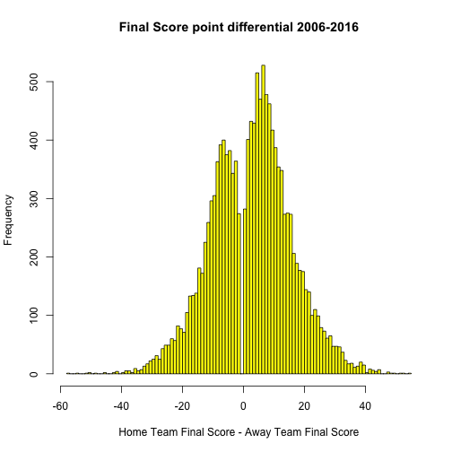
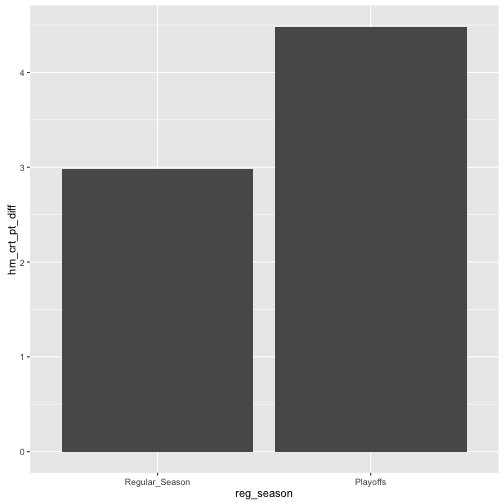
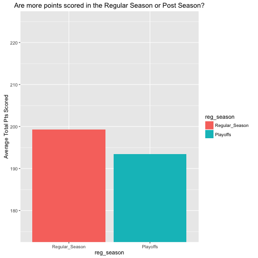

```
##    Min. 1st Qu.  Median    Mean 3rd Qu.    Max. 
## -58.000  -6.000   4.000   3.093  12.000  55.000
```



```
## # A tibble: 11 x 3
##     year start_date   end_date
##    <dbl>     <date>     <date>
## 1   2006 2006-01-01 2006-12-31
## 2   2007 2007-01-01 2007-12-31
## 3   2008 2008-01-02 2008-12-31
## 4   2009 2009-01-02 2009-12-31
## 5   2010 2010-01-01 2010-12-31
## 6   2011 2011-01-01 2011-12-31
## 7   2012 2012-01-01 2012-12-31
## 8   2013 2013-01-01 2013-12-31
## 9   2014 2014-01-01 2014-12-31
## 10  2015 2015-01-01 2015-12-31
## 11  2016 2016-01-01 2016-06-19
```

```
## [1] 0.2755043
```

```
##    Min. 1st Qu.  Median    Mean 3rd Qu.    Max. 
##    1.00    6.00   10.00   11.73   16.00   55.00
```

```
##    Min. 1st Qu.  Median    Mean 3rd Qu.    Max. 
##  -58.00  -13.00   -8.00   -9.87   -5.00   -1.00
```



# ------- Total points scored over time --------


```
## Error: <text>:15:0: unexpected end of input
## 13:   dplyr::select(first_half_pts, second_half_pts) %>% 
## 14:   tidyr::gather(., half, pts) %>%
##    ^
```

# - What % of the time do overtime games occur? 

```
## [1] 0.06247279
```


