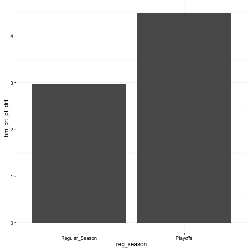
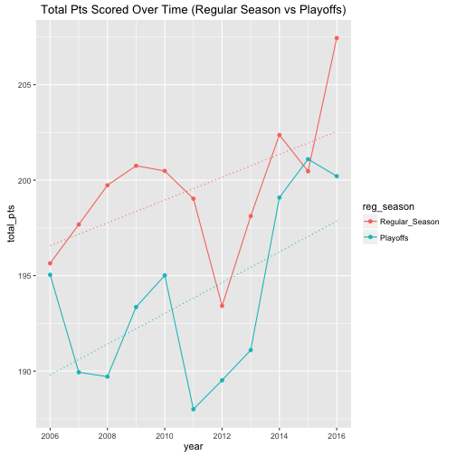
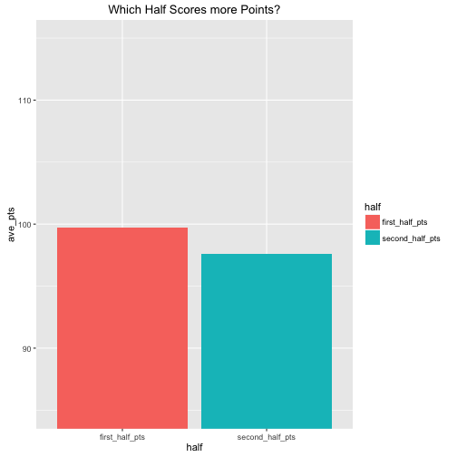

### How much is home court advantage worth?


```
## Final Home Score - Final Away Team Score:
```

```
##    Min. 1st Qu.  Median    Mean 3rd Qu.    Max. 
## -58.000  -6.000   4.000   3.093  12.000  55.000
```
 * *Analysis: Interesting to note above is a bimodal distribution with close games occuring relatively infrequently. 
   This would imply it would be advantegeous to bet moneyline rather than Point spread on smaller spreads.*  

##### Contingent on a home court team winning, how much does a team typically win by?

```
##    Min. 1st Qu.  Median    Mean 3rd Qu.    Max. 
##    1.00    6.00   10.00   11.73   16.00   55.00
```

### Does home court advantge differ in the regular season vs the playoffs?

  * *Analysis: Suprisingly the playoffs offer a stronger home court advantage*

### Is home court advantage diminishing over time? 

  * *Analysis: Generally home court advantage is slightly decreasing over time. 
    However last year within 2016 there was a strong resurgance for Home Court within the playoffs.* **Theories?**

# Total points scored Analysis

  * *Analysis: Less points per game are scored within playoffs. 
    Likely due too diminished pace or more conservative foul calls by referees.* TODO: Can verify both hypothesis



  * *General trajectory of the league is increasing point totals. 2011 was lockout year and explains dampened point totals*

### Which Half Scores mores points?

  * *Analysis: Despite a team's being in foul trouble counter intuitively within 2nd half slightly less points are scored*

### What % of games go into overtime? 

```
## [1] 6.247279
```


